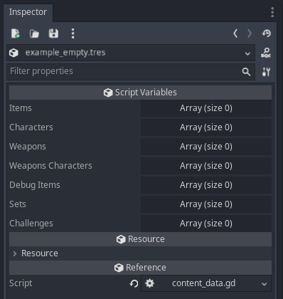
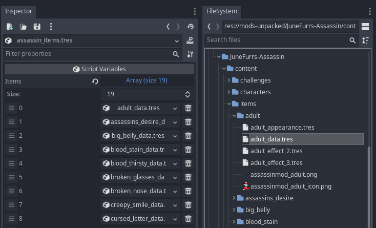
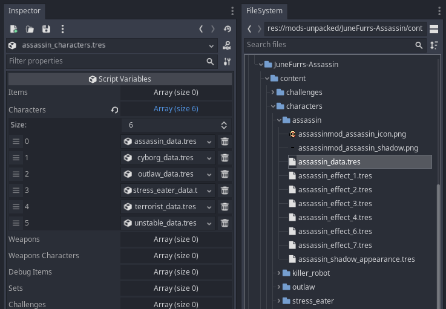
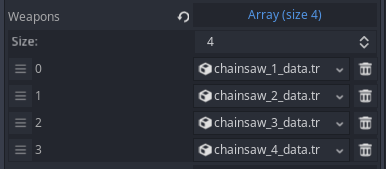
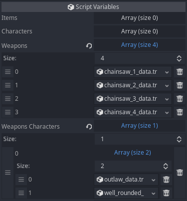
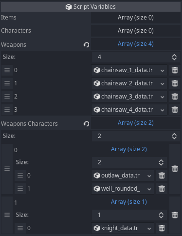
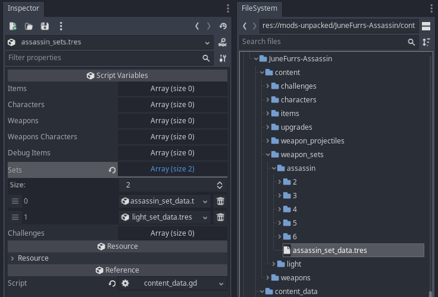
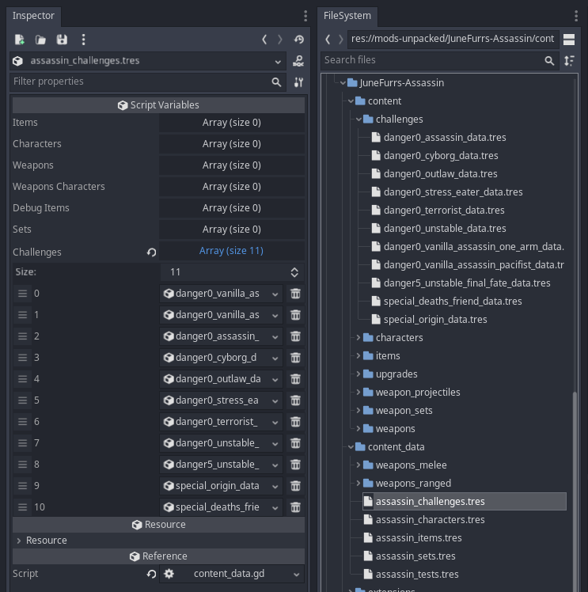

# Brotato - ContentLoader

 [^1]

ContentLoader makes it easy to add new content to Brotato.

You can add: *Characters, Items, Weapons, Weapon Sets, Challenges (for all danger levels).*

For references, see the mods that use ContentLoader in [Notable Mods](#notable-mods) below.

## TOC

- [Requirements](#requirements)
- [Structure](#structure)
- [Adding Content](#adding-content)
- [ContentData Resources](#contentdata-resources)
- [Items](#items)
- [Characters](#characters)
- [Weapons](#weapons)
- [Weapon's Characters](#weapons-characters)
- [Weapon Sets (Classes)](#weapon-sets-classes)
- [Challenges](#challenges)
- [Debug Items](#debug-items)
- [Appendix](#appendix)


## Requirements

- [ModLoader](https://github.com/GodotModding/godot-mod-loader) *(v4.1 or above)*
* [Brotils](https://github.com/BrotatoMods/Brotato-Brotils/) - v1.0+


## Structure

Beyond ModLoader's [required structure](https://github.com/GodotModding/godot-mod-loader/wiki/Mod-Structure), you are free to structure your ContentLoader mods however you want.

However, there is a recommended structure. Following this will make your mod easier to edit and maintain, and make it easier for other modders to provide support to you.

You can refer to the examples of [Invasion](https://github.com/BrotatoMods/Brotato-Invasion-Mod/tree/main/root/mods-unpacked/Darkly77-Invasion) and [Assassin](https://github.com/BrotatoMods/Brotato-Assassin-Mod/tree/main/root/mods-unpacked/JuneFurrs-Assassin) to see how this looks for finished mods. Here's what their folders mean:

- `content` - Stores all the custom content, with subfolders for each type (`items`, `weapons`, etc)
- `content_data` - For your *ContentData* resource files
- `extensions` - For code that extends vanilla
- `translations` - Translation CSVs (ie. custom text for item descriptions, etc)

> 💡 *Tip: For your images, it is **highly** recommended that you prefix all filenames with `yourmodname_`. See [.import](https://github.com/GodotModding/godot-mod-loader/wiki/Mod-Structure#import) on the ModLoader Wiki for info on the benefits of this.*


## Adding Content

To add content to the game: In your mod's `_ready()` method, get the ContentLoader class and use its `load_data` method.

```gdscript
func _ready()->void:
	# Get the ContentLoader class
	var ContentLoader = get_node("/root/ModLoader/Darkly77-ContentLoader/ContentLoader")

	var content_dir = "res://mods-unpacked/Author-ModName/content_data/"
	var mod_log = "Author-ModName"

	# Add content. These .tres files are ContentData resources
	ContentLoader.load_data(content_dir + "modname_characters.tres", mod_log)
	ContentLoader.load_data(content_dir + "modname_items.tres", mod_log)
```

> ℹ️ *Note: ModLoader does not support global classes, which is why we need to use the `get_node` approach shown here. See [Advanced > Child Nodes](https://github.com/GodotModding/godot-mod-loader/wiki/Advanced#child-nodes) on the ModLoader Wiki for more info.*


## ContentData Resources

Use the `ContentData` resource class to set up the content you want to add.

To create a new ContentData resource:

- Right-click a folder
- Choose "Add New Resource"
- In the search bar, enter `ContentData`
- Choose the resource shown (it's the *content_data.gd* file)
- You can now add your content by dragging your data files into the respective arrays.

> ℹ *Note: Godot may have an issue where `ContentData` is not available when trying to create a new resource. To fix this, ContentLoader provides an empty ContentData resrouce called* **EXAMPLE.tres**. *It's in ContentLoader's [main mod folder](https://github.com/BrotatoMods/Brotato-ContentLoader/tree/main/root/mods-unpacked/Darkly77-ContentLoader), and you can duplicate this file into your own mod's folders.*

> 💡 *Tip: Once you've created your first ContentData resource, you can create another one quickly by right-clicking it and choosing Duplicate (or click it and use the keyboard shortcut <kbd>Ctrl</kbd> + <kbd>D</kbd>.*

By default, a new ContentData resource looks like this:




## Items

Add ItemData resource files to the **Items** array.

You can drag and drop resource files onto the array box.



> ⚠️ *Warning: There's a bug in Godot where if you don't expand the array before you drag items onto it, the existing items may be wiped. So always expand arrays before you add to them!*


## Characters

Add CharacterData resource files to the **Characters** array.




## Weapons

Add WeaponData resources to the **Weapons** array.

In the setup shown here, we've added a weapon called "Chainsaw". Note how each tier of the weapon is added separately.




## Weapon's Characters

This lists the characters who can start with a weapon. It requires weapons to be added via `weapons` in the same ContentData resource file.

It is an array of arrays:

- The top-most array corresponds to the weapons in `weapons`.
- Within each of these arrays, their own array is a list of characters who can start with that weapon.

> 💡 *Tip: Adding each individual weapon as a separate ContentData resource will make using `weapon_characters` much easier.*

### Example 1

This setup adds the 4 tiers for "Chainsaw" (as shown above), and also adds two characters who can start with the Tier 1 version of the weapon (ie. *chainsaw_1_data.tres*, which appears first in the `weapons` array, and so corresponds with the 1st top-level array in **Weapons Characters**):



### Example 2

This next setup does the same, but also adds Knight as a starting character for the Tier 2 version (ie. *chainsaw_2_data.tres*, which appears second in the `weapons` array, and so corresponds with the 2nd top-level array in **Weapons Characters**):




## Weapon Sets (Classes)

Add your custom weapon set resources to the **Sets** array. They can be added to a weapon's `sets` array just like vanilla sets.




## Challenges

Add Challenge items to the **Challenges** array:




## Debug Items

Adding items to the "Debug Items" array will add them to every character you play as, for every run. It has the same effect as using the `debug_items` array in DebugService.

It is used by [Invasion](https://github.com/BrotatoMods/Brotato-Invasion-Mod) to add a [special item](https://github.com/BrotatoMods/Brotato-Invasion-Mod/tree/main/root/mods-unpacked/Darkly77-Invasion/content/items/z_info) that shows the current version of the Invasion mod. This special item is not added to the normal Items array, and is not marked as "unlocked by default", which means it's not part of the shop pool. You may wish to do something similar in your own mod.


## Appendix

### Purpose

ContentLoader adds content to `ItemService`, which is possible without using ContentLoader.

However, it also performs a number of other important functions, including:

- Safely adds custom content to `ProgressData.upgrades_unlocked`.
- Initialises custom characters *(which need to have their own `CharacterDifficultyInfo` object)*.
- Adds custom weapons to corresponding characters.
- Duplicates the debug_items and debug_weapons arrays before adding to them *(which fixes a critical issue in Godot's engine)*.
- Tracks all added content *(allowing any mod to see what content has been added, and by which mod)*.
- Re-runs the applicable vanilla funcs after adding content.


### Notable Mods

The mods listed here were created or ported by Darkly77, ContentLoader's lead developer. They show how to use its various features in a standardised way.

Their *mod_main.gd* file is the entry point for ContentLoader.

| Mod | mod_main.gd |
| --- | ----------- |
| [Assassin](https://github.com/BrotatoMods/Brotato-Assassin-Mod) | [mod_main.gd](https://github.com/BrotatoMods/Brotato-Assassin-Mod/blob/main/root/mods-unpacked/JuneFurrs-Assassin/mod_main.gd) |
| [Invasion](https://github.com/BrotatoMods/Brotato-Invasion-Mod) | [mod_main.gd](https://github.com/BrotatoMods/Brotato-Invasion-Mod/blob/main/root/mods-unpacked/Darkly77-Invasion/ModMain.gd) |

### Credits

ContentLoader was created by [Darkly77](https://github.com/ithinkandicode), with contributions from [KANA](https://github.com/KANAjetzt).

It is based on [dami's Multiple Mod Support](https://github.com/BrotatoMods/Brotato-damis-Multiple-Mod-Support), and its core functionality still uses dami's code.

[^1]: *download counter: the repo had to change so the counter got wiped, was 250, RIP*
