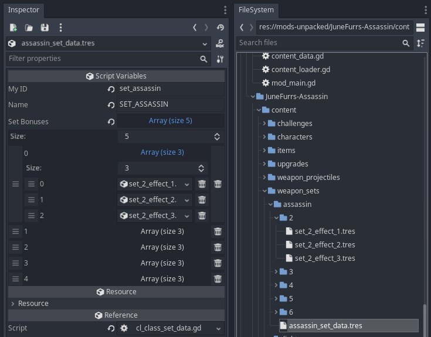
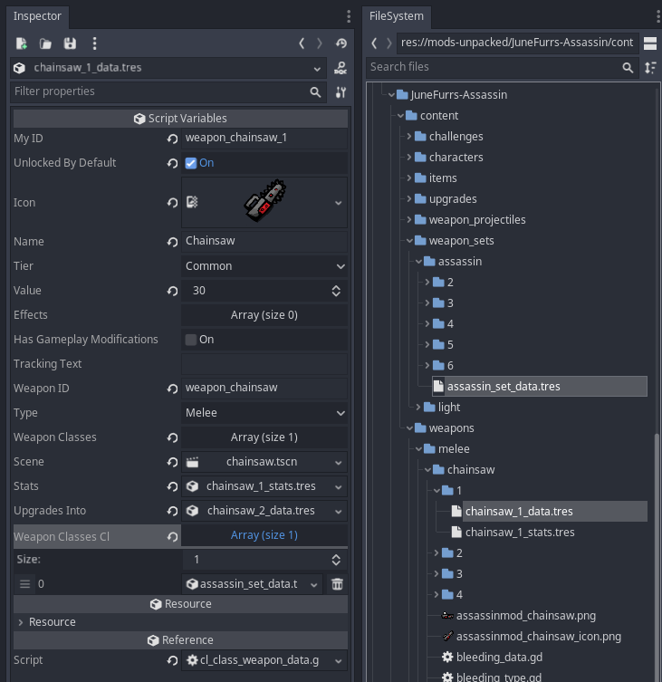

# Brotato - ContentLoader


ContentLoader makes it easy to add new content to Brotato. You can add:

- Characters
- Items
- Weapons
- Weapon Sets
- Challenges (for all danger levels)

*For references, see the mods that use ContentLoader in [Notable Mods](#notable-mods) below.*

## Requirements

- [ModLoader](https://github.com/GodotModding/godot-mod-loader) *(v4.1 or above)*
* [Brotils](https://github.com/BrotatoMods/Brotato-Brotils/) - v1.0+


## Structure

Beyond ModLoader's [required structure](https://github.com/GodotModding/godot-mod-loader/wiki/Mod-Structure), you are free to structure your ContentLoader mods however you want.

However, there is a recommended structure. Following this will make your mod easier to edit and maintain, and make it easier for other modders to provide support to you:

- `content` - Stores all the custom content, with subfolders for each type (`items`, `weapons`, etc)
- `content_data` - For your *ContentData* resource files
- `extensions` - For code that extends vanilla
- `translations` - Translation CSVs (ie. custom text for item descriptions, etc)

You can refer to the examples of [Invasion](https://github.com/BrotatoMods/Brotato-Invasion-Mod/tree/main/root/mods-unpacked/Darkly77-Invasion) and [Assassin](https://github.com/BrotatoMods/Brotato-Assassin-Mod/tree/main/root/mods-unpacked/JuneFurrs-Assassin) to see how this looks for finished mods.

> 💡 *Tip: For your images, it is **highly** recommended that you prefix all filenames with `yourmodname_`. See [.import](https://github.com/GodotModding/godot-mod-loader/wiki/Mod-Structure#import) on the ModLoader Wiki for more info on why this is so beneficial.*


## Adding Content

To add content to the game: In your mod's `_ready()` method, get the ContentLoader class and use its `load_data` method.

```gdscript
func _ready()->void:
	# Get the ContentLoader class
	var ContentLoader = get_node("/root/ModLoader/Darkly77-ContentLoader/ContentLoader")

	var content_dir = "res://mods-unpacked/Author-ModName/content_data/"
	var mod_log = "Author-ModName"

	# Add content. These .tres files are ContentData resources
	ContentLoader.load_data(content_dir + "modname_characters.tres", mod_log)
	ContentLoader.load_data(content_dir + "modname_items.tres", mod_log)
```

> ℹ️ *Note: ModLoader does not support global classes, which is why we need to use the `get_node` approach shown here. See [Advanced > Child Nodes](https://github.com/GodotModding/godot-mod-loader/wiki/Advanced#child-nodes) on the ModLoader Wiki for more info.*


## ContentData Resources

Use the `ContentData` resource class to set up the content you want to add.

To create a new ContentData resource:

- Right-click a folder
- Choose "Add New Resource"
- In the search bar, enter `ContentData`
- Choose the resource shown (it's the *content_data.gd* file)
- You can now add your content by dragging your data files into the respective arrays.

> 💡 *Tip: Once you've created your first ContentData resource, you can create another one quickly by right-clicking it and choosing Duplicate (or click it and use the keyboard shortcut <kbd>Ctrl</kbd> + <kbd>D</kbd>.*

By default, a new ContentData resource looks like this:


## Items

Add ItemData resource files to the **Items** array.

You can drag and drop resource files onto the array box.


> ⚠️ *Warning: There's a bug in Godot where if you don't expand the array before you drag items onto it, the existing items may be wiped. So always expand arrays before you add to them!*


## Characters

Add CharacterData resource files to the **Characters** array.


## Weapons

Add WeaponData resources to the **Weapons** array.

In the setup shown here, we've added a weapon called "Chainsaw". Note how each tier of the weapon is added separately.


> ⚠️ *Warning: If you intend to use custom weapon sets, use ContentLoader's extended version of the WeaponData class, called `CLWeaponData`. See "Weapon Sets" below for more info.*


## Weapon's Characters

This lists the characters who can start with a weapon. It requires weapons to be added via `weapons` in the same ContentData resource file.

It is an array of arrays:

- The top-most array corresponds to the weapons in `weapons`.
- Within each of these arrays, their own array is a list of characters who can start with that weapon.

> 💡 *Tip: Adding each individual weapon as a separate ContentData resource will make using `weapon_characters` much easier.*

### Example 1

This setup adds the 4 tiers for "Chainsaw" (as shown above), and also adds two characters who can start with the Tier 1 version of the weapon (ie. *chainsaw_1_data.tres*, which appears first in the `weapons` array, and so corresponds with the 1st top-level array in **Weapons Characters**):


### Example 2

This next setup does the same, but also adds Knight as a starting character for the Tier 2 version (ie. *chainsaw_2_data.tres*, which appears second in the `weapons` array, and so corresponds with the 2nd top-level array in **Weapons Characters**):


## Weapon Sets (Classes)

Vanilla Brotato uses enums for weapon sets (aka classes/types). These enums can't be extended, so ContentLoader uses a different approach, and provides 2 custom classes to do so:

| Class | Based On | Details | Used for |
| ----- | -------- | ------- | ----- |
| `CLSetData`  | `SetData` | Adds two string variables: `my_id` and `name`. | Custom weapon sets |
| `CLWeaponData` | `WeaponData` | Adds the variable `weapon_classes_cl`, an array of `CLSetData` resources. | Weapons with custom sets |


### Create a custom set

To create a new weapon set, right-click a folder, choose "*Create New Resource*", type `CLSetData`, and choose the custom class.

- The variable `my_id` ("My ID") should be named `set_yoursetname`.
  - Replace `yoursetname` with the actual set name.
  - This must be unique.
- The variable `name` ("Name") can be anything.
  - As with many other string variables, you can use a translatable string here (see [ModLoader Wiki](https://github.com/GodotModding/godot-mod-loader/wiki/API-Methods#add_translation_from_resource)).
- The variable `set_bonuses` ("Set Bonuses") is an array, and is used in the same way as vanilla sets.
  - The array should have a size of `5`:
    - The 1st array item (`0`) is applied when the player has 2 weapons in a set
    - The 2nd array item (`1`) is applied when they have 3
    - The 3rd array item (`2`) is applied when they have 4
    - The 4th array item (`3`) is applied when they have 5
    - The 5th array item (`4`) is applied when they have 6



### Add a custom set to a weapon

The `CLWeaponData` class is identical to the vanilla version, but also supports custom weapon sets.

To apply a custom set to a weapon, drag and drop the CLSetData resource into the "Weapon Classes CL" array:



> ⚠️ *Warning: It's recommended that you always create new weapons using this class, rather than vanilla's `WeaponData`. This is because, if you want to switch to `CLWeaponData` later, you'll need to do edit your weapons to use it via an external code editor. If you try to change from `WeaponData` to `CLWeaponData` through the Godot Editor, all previously assigned values will be wiped for that weapon.*

### Add sets to ContentLoader

Add your custom weapon set resources to the **Sets** array.


## Challenges

Add Challenge items to the **Challenges** array:


### CLChallengeData

Vanilla's challenges are limited to only Danger0 unlocks. To extend this, ContentLoader provides a custom resource class, `CLChallengeData`, which is based on the vanilla class `ChallengeData`.

Like with the other custom resource classes, to create an empty one: Right-click a folder, choose *"Create New Resource"*, and enter the class name: `CLChallengeData`.

### Variables

You can use any combination of these.

| Var | Description |
| --- | ----------- |
| Must Win Run | Player must win the run to unlock the challenge. Best for Danger challenges |
| Required Character | If set, the specified character must be used |
| Required Danger Number | If set and not `-1`, the specified Danger number must be played |
| Required Weapons AND | Array of weapon resources (`WeaponData` or `CLWeaponData`). <br>All of the specific weapons must be held, at any point during the run |
| Required Weapons OR | As above, but the player can hold *any* or the specified weapons |
| Required Items AND | Array of item resources (`ItemData`). <br>All of the specific items must be held, at any point during the run |
| Required Items OR | As above, but the player can hold *any* or the specified items |

### Translation Strings

ContentLoader comes packaged with a few translation strings for challenge descriptions. They're added via this file: [mod_contentloader_text.csv](https://github.com/BrotatoMods/Brotato-ContentLoader/blob/main/root/mods-unpacked/Darkly77-ContentLoader/translations/mod_contentloader_text.csv).

| String | Description |
| ------ | ----------- |
| `CL_CHAL_CHAR_DANGER_0`    | Win a run with `{Character}` |
| `CL_CHAL_CHAR_DANGER_ANY`  | Win a run with `{Character}` in Danger `{DangerLevel}` |
| `CL_CHAL_STAT`             | Reach `{StatValue}` `{StatName}` |
| `CL_CHAL_STAT_CHARACTER`   | Reach `{StatValue}` `{StatName}` with `{Character}` |
| `CL_CHAL_HOLD_ITEMS_ALL`   | Hold all of these items at the same time: `{Items}` |
| `CL_CHAL_HOLD_ITEMS_ANY`   | Hold any of these items at the same time: `{Items}` |
| `CL_CHAL_HOLD_WEAPONS_ALL` | Hold all of these weapons at the same time: `{Weapons}` |
| `CL_CHAL_HOLD_WEAPONS_ANY` | Hold any of these weapons at the same time: `{Weapons}` |
| `CL_CHAL_TEST_ALL_OPTIONS` | Demo showing all of the available options |

You can also use these vanilla translation strings:

| String | Description |
| ------ | ----------- |
| `CHAL_DIFFICULTY_DESC` | Win a run with {Character} *-- same as `CL_CHAL_CHAR_DANGER_0`* |

#### Translation Variables

CLChallengeData challenges also provide additional variables to translation strings (which are transformed via vanilla's func `text` in *singletons/text.gd*).

| Var | Description | Notes |
| --- | ----------- | ----- |
| `{0}` | Character Name | - |
| `{1}` | Danger Level | - |
| `{2}` | AND Weapons | If there are 2 weapons/items, they are joined with `and`. <br>For more than two, they're joined with `,`. |
| `{4}` | OR Weapons | *same as above* |
| `{3}` | AND Items | *same as above* |
| `{5}` | OR Items | *same as above* |

For example, you could create a challenge for Brawler on Danger 4, and use this description text:

> "Win a devilishly difficult Danger `{1}` run with `{0}`"

Which would be displayed in-game as:

> "Win a devilishly difficult Danger 4 run with Brawler"

#### Translation Tips

- You can use `\n` to create new lines in translation strings.
- If your translation string has a comma (`,`), you **must** wrap the full string in quotes, eg `"my string, is this"`
  - If you don't do this, that string, and any strings that follow it, will not work.


## Debug Items

Adding items to the "Debug Items" array will add them to every character you play as, for every run. It has the same effect as using the `debug_items` array in DebugService.

It is used by [Invasion](https://github.com/BrotatoMods/Brotato-Invasion-Mod) to add a [special item](https://github.com/BrotatoMods/Brotato-Invasion-Mod/tree/main/root/mods-unpacked/Darkly77-Invasion/content/items/z_info) that shows the current version of the Invasion mod. This special item is not added to the normal Items array, and is not marked as "unlocked by default", which means it's not part of the shop pool. You may wish to do something similar in your own mod.


## Appendix

### Notable Mods

The mods listed here were created or ported by Darkly77, ContentLoader's lead developer. They show how to use its various features in a standardised way.

Their *mod_main.gd* file is the entry point for ContentLoader.

| Mod | mod_main.gd |
| --- | ----------- |
| [Assassin](https://github.com/BrotatoMods/Brotato-Assassin-Mod) | [mod_main.gd](https://github.com/BrotatoMods/Brotato-Assassin-Mod/blob/main/root/mods-unpacked/JuneFurrs-Assassin/mod_main.gd) |
| [Invasion](https://github.com/BrotatoMods/Brotato-Invasion-Mod) | [mod_main.gd](https://github.com/BrotatoMods/Brotato-Invasion-Mod/blob/main/root/mods-unpacked/Darkly77-Invasion/ModMain.gd) |

### Credits

ContentLoader was created by [Darkly77](https://github.com/ithinkandicode), with contributions from [KANA](https://github.com/KANAjetzt).

It is based on [dami's Multiple Mod Support](https://github.com/BrotatoMods/Brotato-damis-Multiple-Mod-Support), and its core functionality still uses dami's code.
